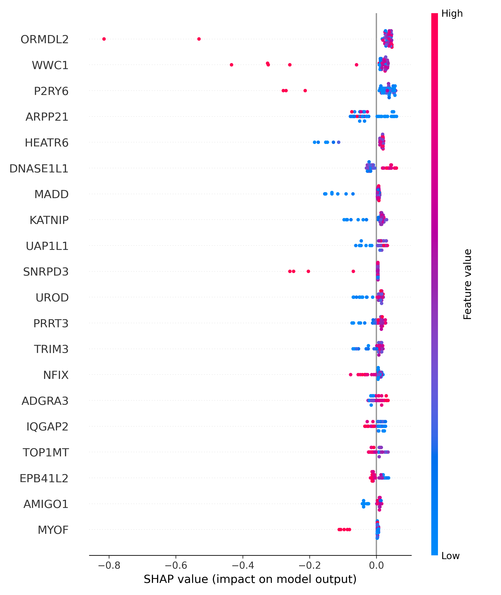

#  ML Drug Response Biomarker Discovery

This project builds an expression-based machine learning model to predict **Erlotinib drug response** using cancer cell line data from **GDSC1** and **DepMap (CCLE)**, with **SHAP-based interpretability** to identify potential biomarkers.

---

## Overview

- Drug: **Erlotinib**
- Target: **EGFR**
- Response metric: **LN_IC50**
- Samples used: **236 cell lines**
- Features: **11,299 gene expression features**
- Model: **XGBoost Regressor**
- Performance:
  - R² ≈ **0.21**
  - RMSE ≈ **0.81**

---

## Workflow

1. Curated GDSC1 fitted dose-response data for Erlotinib
2. Mapped GDSC cell lines to DepMap IDs
3. Integrated CCLE gene expression data
4. Trained ML regression model
5. Interpreted predictions using SHAP

---

## Results

### SHAP summary (Top 20 genes)

### Tables
- `results/expression_model/tables/shap_importance_all_genes.csv`
- `results/expression_model/tables/shap_top20_directionality.csv`

---

## Repository Structure

ml-drug-response-biomarker-discovery/
├── notebooks/
│ ├── 01_env_check.ipynb
│ ├── 02_download_depmap_data.ipynb
│ └── 03_expression_features.ipynb
├── results/
│ └── expression_model/
│ ├── plots/
│ └── tables/
├── .gitignore
└── README.md
---

## Notes

Raw expression matrices and large datasets are **not tracked** in this repository due to size constraints.  
Users can download them from:
- https://depmap.org/portal/download/
- https://www.cancerrxgene.org/

